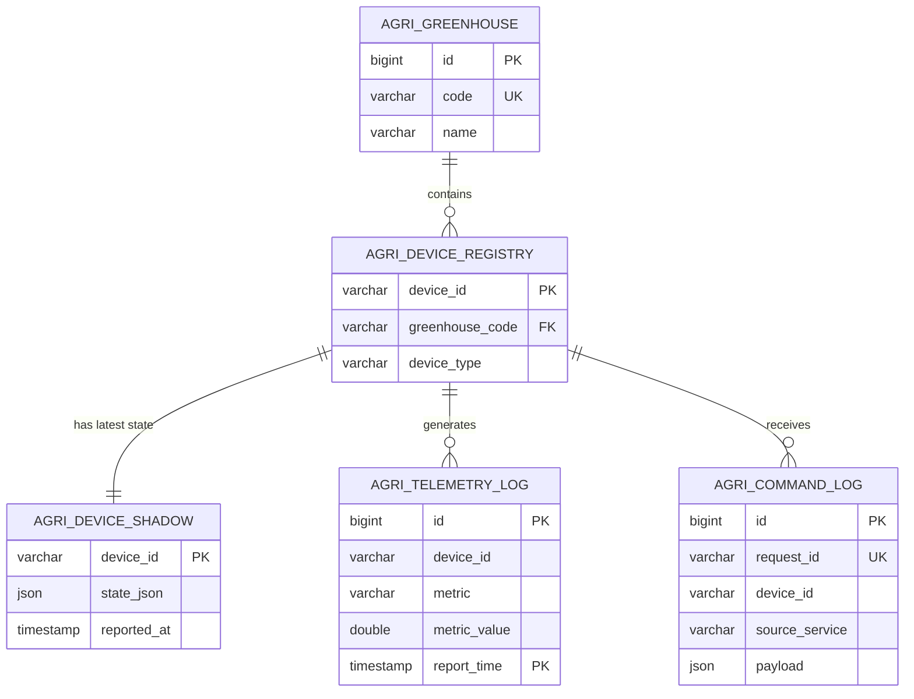

# 智慧农业服务 (agri-services) 数据库重构与优化方案文档

## 1. 现有架构分析与痛点

通过分析各个微服务（`iot-access-service`、`device-control-service`、`light-schedule-service`、`composite-condition-service`、`greenhouse-monitor-service`）的 Flyway 迁移脚本，当前数据库架构存在以下明显问题：

### 1.1 数据碎片化与冗余 (Data Fragmentation)
- **设备最新状态**：分散在 `device_status` (device-control)、`sensor_latest_data` (composite-condition) 和 `greenhouse_sensor_snapshot` (greenhouse-monitor) 中。这导致一个设备上报数据时，多个服务可能需要分别落盘，引起数据不一致和写放大。
- **指令执行日志**：分散在 `iot_device_command_log`、`device_control_command`、`light_schedule_execution_log`、`linkage_action_log` 中，缺乏统一的指令追溯视图。
- **基础元数据**：大棚与设备映射仅通过 `device_greenhouse_mapping` 维护，缺乏统一的全局“设备资产表(Device Registry)”。

### 1.2 性能瓶颈与扩展性隐患 (Performance Bottlenecks)
- **IoT 高频写入**：根据 BearPi 硬件源码逻辑（`iot_cloud_oc_sample.c` 中的 `task_sensor_entry`），传感器**每隔 3 秒**就会上报一次包含温湿度、光照的数据。旧架构下 `iot_device_telemetry` 使用标准的自增主键 InnoDB 表，未做分表或时间分区。随着单设备每 3 秒一条的插入速率，如果接入 100 台设备，一天将产生近 300 万条数据，该表会迅速膨胀，导致查询（尤其是聚合查询）和写入性能急剧下降。
- **索引策略不佳**：部分日志表未针对查询场景（如时间范围查询、特定设备状态聚合）建立联合索引，容易引发全表扫描。

---

## 2. 新数据库架构设计原则

1. **统一基础数据中心 (Master Data Management)**：建立全局统一的“大棚”、“设备”、“设备-大棚映射”字典表。
2. **设备影子分离 (Device Twin)**：分离“高频流水(Telemetry)”与“最新状态快照(Shadow)”。最新状态保存在单张 Shadow 表中（可结合 Redis 缓存），流水存入归档表。
3. **应对高并发写入 (Time-Series Optimization)**：针对 MySQL 5.7，对 `agri_telemetry_log` 使用 **Table Partitioning (按时间分区)**，并引入 Kafka 削峰填谷。
4. **统一日志追踪 (Unified Auditing)**：统一 `agri_command_log` 表，通过 `source_service` 区分是手动控制、定时任务还是条件联动触发的命令。

---

## 3. 规范化表结构设计与数据字典

重构后的表结构统一加上 `agri_` 前缀，以明确业务域并与历史遗留表区分，保障兼容期双写。

### 3.1 核心主数据模块 (Master Data)

**表 1：`agri_greenhouse` (大棚主表)**
管理农业大棚的基础信息。
| 字段名 | 类型 | 约束 | 描述 |
|---|---|---|---|
| `id` | BIGINT | PK, AUTO_INCREMENT | 唯一标识 |
| `code` | VARCHAR(64) | UNIQUE, NOT NULL | 大棚编码 (如 GH-01) |
| `name` | VARCHAR(128) | NOT NULL | 大棚名称 |
| `crop_type` | VARCHAR(128) | | 种植作物类型 |
| `status` | VARCHAR(16) | NOT NULL DEFAULT 'ACTIVE' | 状态 (ACTIVE, INACTIVE) |
| `created_at` | TIMESTAMP | NOT NULL | 创建时间 |
| `updated_at` | TIMESTAMP | NOT NULL | 更新时间 |

**表 2：`agri_device_registry` (设备注册表)**
所有接入系统的 IoT 设备档案库。
| 字段名 | 类型 | 约束 | 描述 |
|---|---|---|---|
| `device_id` | VARCHAR(64) | PK | 华为云或直连设备的全局唯一ID |
| `device_name` | VARCHAR(128) | NOT NULL | 设备别名 |
| `device_type` | VARCHAR(32) | NOT NULL | 设备类型 (SENSOR, CONTROLLER, GATEWAY) |
| `greenhouse_code`| VARCHAR(64) | FK | 所属大棚编码，允许为空 |
| `created_at` | TIMESTAMP | NOT NULL | 注册时间 |
| `updated_at` | TIMESTAMP | NOT NULL | 更新时间 |
*索引：`idx_greenhouse_code (greenhouse_code)`*

### 3.2 高并发物联网数据模块 (IoT Data)

**表 3：`agri_device_shadow` (设备影子快照表)**
仅保存设备各项指标的**最新值**，支持极速读取（联动规则引擎强依赖此表）。
| 字段名 | 类型 | 约束 | 描述 |
|---|---|---|---|
| `device_id` | VARCHAR(64) | PK | 设备ID |
| `state_json` | JSON | NOT NULL | 包含所有最新属性值的 JSON (MySQL 5.7 支持) |
| `is_online` | BOOLEAN | NOT NULL DEFAULT TRUE| 设备在线状态 |
| `reported_at` | TIMESTAMP | NOT NULL | 最后上报时间 |

**表 4：`agri_telemetry_log` (设备遥测流水表)**
记录所有历史遥测数据。**核心优化：按月进行 RANGE 分区 (Partitioning)。**
| 字段名 | 类型 | 约束 | 描述 |
|---|---|---|---|
| `id` | BIGINT | AUTO_INCREMENT | 逻辑主键 |
| `device_id` | VARCHAR(64) | NOT NULL | 设备ID |
| `metric` | VARCHAR(64) | NOT NULL | 测量指标 (如 temperature, humidity) |
| `metric_value`| DOUBLE | NOT NULL | 指标数值 |
| `report_time` | TIMESTAMP | NOT NULL | 采集时间 (分区键) |
*注意：在 MySQL 中，分区键必须包含在主键中，实际主键为 `(id, report_time)`。*
*复合索引：`idx_device_time (device_id, report_time DESC)` 用于加速特定设备的历史趋势查询。*

### 3.3 指令与规则执行模块 (Command & Automation)

**表 5：`agri_command_log` (统一指令下发日志)**
合并了手动控制、定时计划、联动规则触发的所有命令记录。
| 字段名 | 类型 | 约束 | 描述 |
|---|---|---|---|
| `id` | BIGINT | PK, AUTO_INCREMENT | 日志ID |
| `request_id` | VARCHAR(64) | UNIQUE | 业务请求/追踪ID |
| `device_id` | VARCHAR(64) | NOT NULL | 目标设备ID |
| `source_service`| VARCHAR(32) | NOT NULL | 发起方 (MANUAL, SCHEDULE, LINKAGE) |
| `command_type` | VARCHAR(64) | NOT NULL | 命令类型 (如 LED_CONTROL) |
| `payload` | JSON | | 指令详细内容 |
| `status` | VARCHAR(32) | NOT NULL | 状态 (PENDING, SUCCESS, FAILED) |
| `created_at` | TIMESTAMP | NOT NULL | 发起时间 |
| `updated_at` | TIMESTAMP | NOT NULL | 响应时间 |
*复合索引：`idx_device_source_time (device_id, source_service, created_at DESC)`*

---

## 4. 架构优化与 ER 图映射

### 4.1 数据流向与性能优化设计
1. **写入链路削峰**：IoT 设备上报数据先进入 Kafka Topic (`telemetry-topic`)。`iot-access-service` 消费消息后，进行双写操作：
   - 强一致性写入 Redis 缓存和 `agri_device_shadow`（更新设备最新状态，供规则引擎快速匹配）。
   - 异步批量插入 `agri_telemetry_log`（缓解高频单条 Insert 对 MySQL 磁盘 I/O 的压力）。
2. **读写分离与水平扩展**：`agri_telemetry_log` 是纯 Insert 表。未来系统扩大时，可将该表迁移至专门的时序数据库 (TSDB, 如 InfluxDB) 或配置 MySQL 主从同步，业务服务从从库读取历史趋势图表数据。
3. **冷热数据分离**：MySQL 表分区允许我们通过 `ALTER TABLE agri_telemetry_log DROP PARTITION p_2025_01` 瞬间清理或归档过期（如半年前）的冷数据，无需执行昂贵的 `DELETE` 语句。

### 4.2 核心业务 ER 图模型 (Mermaid)

---

## 5. 迁移方案与回滚策略

为了保证现有基于 `flyway_schema_history_*` 各自独立建表的微服务平滑过渡，采用**双写加视图过渡策略 (Strangler Fig Pattern)**。

### 5.1 第一阶段：结构初始化与双写准备 (Week 1)
1. **新建表结构**：通过各服务的 Flyway 新增迁移脚本（如 `V2__refactor_agri_schema.sql`），创建带 `agri_` 前缀的新表，并配置好分区和索引。
2. **应用层双写**：修改代码，在写入旧表（如 `iot_device_telemetry`）的同一个事务或事件流中，同时写入新表（`agri_telemetry_log`）。
3. **历史数据同步**：编写一次性数据迁移脚本（Data Migration Script/Job），将旧表中现存的历史数据抽取并转换格式插入到新表。

### 5.2 第二阶段：读流量切换 (Week 2)
1. **更新查询接口**：将前端请求（如历史图表、最新状态查询、设备列表查询）的数据源逐步切向新表 `agri_*`。
2. **灰度验证**：对比新旧数据源的查询结果，确保分页、过滤逻辑一致，监控新索引的命中情况。

### 5.3 第三阶段：停用旧表与清理 (Week 3)
1. **停止双写**：应用层移除写入旧表的逻辑，完全依赖新架构。
2. **回滚策略 (Rollback)**：
   - 在停用旧表前，如果发现新架构性能不达标或数据丢失，由于一直在双写旧表，可以直接回滚代码版本（重新指向旧表查询），实现**零停机回滚**。
   - 若停用旧表后需回滚，则需要反向同步工具将新表差异数据导回旧表（通常不建议，应在第二阶段充分验证）。
3. **归档旧表**：将 `iot_device_telemetry`、`device_status` 等旧表重命名为 `*_archive_v1`，确认无误后在下一个维护窗口 `DROP`。

---

## 6. 性能测试基准与验证标准

### 6.1 性能基准 (Baselines)
- **写入吞吐量**：在 4 核 8G MySQL 5.7 实例上，`agri_telemetry_log` 批量插入需支持持续稳定在 `5,000 ~ 10,000 TPS`。
- **查询响应时间**：
  - 设备最新状态查询 (`agri_device_shadow` / Redis) 需在 `P99 < 10ms`。
  - 指定设备 24 小时历史趋势查询（命中复合索引）需在 `P95 < 200ms`。

### 6.2 验证标准
1. **无死锁与慢查询**：在高并发模拟（使用 JMeter 或 Gatling 模拟 1000 个虚拟设备并发上报）下，MySQL 监控日志中无死锁报告，无未命中索引的全表扫描慢查询。
2. **分区自动管理**：验证定时任务（如 Event Scheduler）能否在每个月末自动创建下个月的分区，并正确处理边界数据。
3. **服务解耦与可用性**：即便 `iot-access-service` 瞬间承压，通过 Kafka 缓冲，不会导致 `composite-condition-service` 获取设备最新状态超时（通过独立查 Shadow 表保障）。
