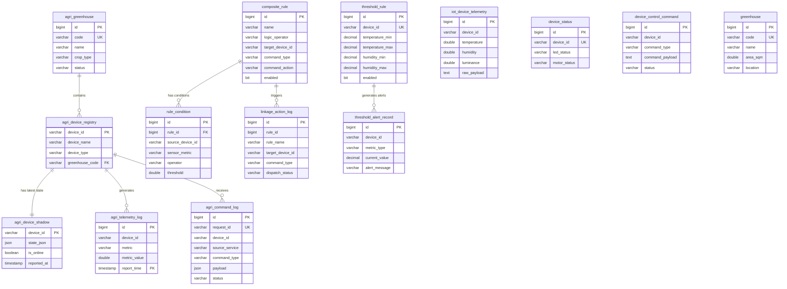

# 智慧农业系统 (dream6) 数据库结构文档

> **数据库**：dream6 | **引擎**：MySQL 5.7+ (InnoDB) | **字符集**：utf8mb4  
> **生成时间**：2026-04-16 | **共计 19 张表**

---

## 目录

- [一、表总览](#一表总览)
- [二、新架构表（agri_ 前缀）](#二新架构表agri_-前缀)
  - [2.1 agri_greenhouse — 大棚主表](#21-agri_greenhouse--大棚主表)
  - [2.2 agri_device_registry — 设备注册表](#22-agri_device_registry--设备注册表)
  - [2.3 agri_device_shadow — 设备影子快照表](#23-agri_device_shadow--设备影子快照表)
  - [2.4 agri_telemetry_log — 设备遥测流水表（按月分区）](#24-agri_telemetry_log--设备遥测流水表按月分区)
  - [2.5 agri_command_log — 统一指令下发日志](#25-agri_command_log--统一指令下发日志)
- [三、旧架构 / 业务表](#三旧架构--业务表)
  - [3.1 iot_device_telemetry — IoT 设备遥测原始数据](#31-iot_device_telemetry--iot-设备遥测原始数据)
  - [3.2 iot_device_command_log — IoT 指令日志](#32-iot_device_command_log--iot-指令日志)
  - [3.3 device_control_command — 设备控制指令记录](#33-device_control_command--设备控制指令记录)
  - [3.4 device_status — 设备状态表](#34-device_status--设备状态表)
  - [3.5 device_greenhouse_mapping — 设备-大棚映射](#35-device_greenhouse_mapping--设备-大棚映射)
  - [3.6 greenhouse — 大棚信息表（旧）](#36-greenhouse--大棚信息表旧)
  - [3.7 greenhouse_sensor_snapshot — 大棚传感器快照](#37-greenhouse_sensor_snapshot--大棚传感器快照)
  - [3.8 sensor_latest_data — 传感器最新数据](#38-sensor_latest_data--传感器最新数据)
  - [3.9 composite_rule — 复合联动规则](#39-composite_rule--复合联动规则)
  - [3.10 rule_condition — 规则条件](#310-rule_condition--规则条件)
  - [3.11 linkage_action_log — 联动执行日志](#311-linkage_action_log--联动执行日志)
  - [3.12 threshold_rule — 阈值告警规则](#312-threshold_rule--阈值告警规则)
  - [3.13 threshold_alert_record — 阈值告警记录](#313-threshold_alert_record--阈值告警记录)
- [四、系统表](#四系统表)
  - [4.1 flyway_schema_history_iot_access — Flyway 迁移记录](#41-flyway_schema_history_iot_access--flyway-迁移记录)
- [五、ER 关系图](#五er-关系图)
- [六、数据统计快照](#六数据统计快照)

---

## 一、表总览

| # | 表名 | 分类 | 记录数 | 说明 |
|---|------|------|--------|------|
| 1 | `agri_greenhouse` | 新架构-主数据 | 0 | 大棚基础信息 |
| 2 | `agri_device_registry` | 新架构-主数据 | 0 | 设备注册档案 |
| 3 | `agri_device_shadow` | 新架构-IoT | 0 | 设备最新状态快照 |
| 4 | `agri_telemetry_log` | 新架构-IoT | 0 | 设备遥测流水（按月分区） |
| 5 | `agri_command_log` | 新架构-指令 | 0 | 统一指令下发日志 |
| 6 | `iot_device_telemetry` | 旧-IoT | 497 | 传感器原始上报数据 |
| 7 | `iot_device_command_log` | 旧-IoT | 5 | IoT 平台指令日志 |
| 8 | `device_control_command` | 旧-设备控制 | 49 | 设备控制指令记录 |
| 9 | `device_status` | 旧-设备控制 | 1 | 设备当前状态 |
| 10 | `device_greenhouse_mapping` | 旧-大棚 | 0 | 设备与大棚绑定关系 |
| 11 | `greenhouse` | 旧-大棚 | 0 | 大棚信息表 |
| 12 | `greenhouse_sensor_snapshot` | 旧-大棚 | 0 | 大棚传感器快照 |
| 13 | `sensor_latest_data` | 旧-联动 | 2 | 传感器最新值 |
| 14 | `composite_rule` | 旧-联动 | 2 | 复合联动规则 |
| 15 | `rule_condition` | 旧-联动 | 2 | 规则触发条件 |
| 16 | `linkage_action_log` | 旧-联动 | 55 | 联动执行日志 |
| 17 | `threshold_rule` | 旧-告警 | 4 | 阈值告警规则 |
| 18 | `threshold_alert_record` | 旧-告警 | 12 | 阈值告警记录 |
| 19 | `flyway_schema_history_iot_access` | 系统 | 1 | Flyway 迁移历史 |

---

## 二、新架构表（agri_ 前缀）

> 这些表是根据 [DATABASE_REFACTORING_PROPOSAL.md](DATABASE_REFACTORING_PROPOSAL.md) 重构方案创建的，目前处于**新旧双写过渡期**，数据尚未迁入。

### 2.1 agri_greenhouse — 大棚主表

管理农业大棚的基础信息，为全局主数据。

| 字段名 | 类型 | 约束 | 默认值 | 说明 |
|--------|------|------|--------|------|
| `id` | BIGINT(20) | PK, AUTO_INCREMENT | — | 唯一标识 |
| `code` | VARCHAR(64) | UNIQUE, NOT NULL | — | 大棚编码（如 GH-01） |
| `name` | VARCHAR(128) | NOT NULL | — | 大棚名称 |
| `crop_type` | VARCHAR(128) | NULL | — | 种植作物类型 |
| `status` | VARCHAR(16) | NOT NULL | `'ACTIVE'` | 状态（ACTIVE / INACTIVE） |
| `created_at` | TIMESTAMP | NOT NULL | `CURRENT_TIMESTAMP` | 创建时间 |
| `updated_at` | TIMESTAMP | NOT NULL | `CURRENT_TIMESTAMP ON UPDATE` | 更新时间 |

**索引：**
- `PRIMARY (id)`
- `UNIQUE code (code)`

---

### 2.2 agri_device_registry — 设备注册表

所有接入系统的 IoT 设备档案库。

| 字段名 | 类型 | 约束 | 默认值 | 说明 |
|--------|------|------|--------|------|
| `device_id` | VARCHAR(64) | PK | — | 设备全局唯一 ID |
| `device_name` | VARCHAR(128) | NOT NULL | — | 设备别名 |
| `device_type` | VARCHAR(32) | NOT NULL | — | 类型（SENSOR / CONTROLLER / GATEWAY） |
| `greenhouse_code` | VARCHAR(64) | NULL | — | 所属大棚编码 |
| `created_at` | TIMESTAMP | NOT NULL | `CURRENT_TIMESTAMP` | 注册时间 |
| `updated_at` | TIMESTAMP | NOT NULL | `CURRENT_TIMESTAMP ON UPDATE` | 更新时间 |

**索引：**
- `PRIMARY (device_id)`
- `idx_greenhouse_code (greenhouse_code)`

---

### 2.3 agri_device_shadow — 设备影子快照表

仅保存设备各项指标的**最新值**，供联动规则引擎快速读取。

| 字段名 | 类型 | 约束 | 默认值 | 说明 |
|--------|------|------|--------|------|
| `device_id` | VARCHAR(64) | PK | — | 设备 ID |
| `state_json` | JSON | NOT NULL | — | 所有最新属性值的 JSON |
| `is_online` | TINYINT(1) | NOT NULL | `1` | 设备在线状态 |
| `reported_at` | TIMESTAMP | NOT NULL | — | 最后上报时间 |

**索引：**
- `PRIMARY (device_id)`

---

### 2.4 agri_telemetry_log — 设备遥测流水表（按月分区）

记录所有历史遥测数据，使用 **RANGE 按月分区** 优化高频写入和冷数据清理。

| 字段名 | 类型 | 约束 | 默认值 | 说明 |
|--------|------|------|--------|------|
| `id` | BIGINT(20) | AUTO_INCREMENT | — | 逻辑主键 |
| `device_id` | VARCHAR(64) | NOT NULL | — | 设备 ID |
| `metric` | VARCHAR(64) | NOT NULL | — | 测量指标（temperature / humidity / luminance 等） |
| `metric_value` | DOUBLE | NOT NULL | — | 指标数值 |
| `report_time` | TIMESTAMP | NOT NULL | `CURRENT_TIMESTAMP` | 采集时间（分区键） |

**索引：**
- `PRIMARY (id, report_time)` — 分区要求分区键包含在主键中
- `idx_device_time (device_id, report_time)` — 加速单设备历史趋势查询

**分区策略（RANGE PARTITION by UNIX_TIMESTAMP）：**

| 分区名 | 范围上界 | 覆盖月份 |
|--------|---------|----------|
| `p202404` | 1714492800 | 2024 年 4 月及之前 |
| `p202405` | 1717171200 | 2024 年 5 月 |
| `p202406` | 1719763200 | 2024 年 6 月 |
| `p202407` | 1722441600 | 2024 年 7 月 |
| `p202408` | 1725120000 | 2024 年 8 月 |
| `p202409` | 1727712000 | 2024 年 9 月 |
| `p202410` | 1730390400 | 2024 年 10 月 |
| `p202411` | 1732982400 | 2024 年 11 月 |
| `p202412` | 1735660800 | 2024 年 12 月 |
| `p_max` | MAXVALUE | 兜底分区 |

---

### 2.5 agri_command_log — 统一指令下发日志

合并手动控制、定时计划、联动规则触发的所有命令记录。

| 字段名 | 类型 | 约束 | 默认值 | 说明 |
|--------|------|------|--------|------|
| `id` | BIGINT(20) | PK, AUTO_INCREMENT | — | 日志 ID |
| `request_id` | VARCHAR(64) | UNIQUE, NULL | — | 业务请求/追踪 ID |
| `device_id` | VARCHAR(64) | NOT NULL | — | 目标设备 ID |
| `source_service` | VARCHAR(32) | NOT NULL | — | 发起方（MANUAL / SCHEDULE / LINKAGE） |
| `command_type` | VARCHAR(64) | NOT NULL | — | 命令类型（如 LED_CONTROL） |
| `payload` | JSON | NULL | — | 指令详细内容 |
| `status` | VARCHAR(32) | NOT NULL | — | 状态（PENDING / SUCCESS / FAILED） |
| `created_at` | TIMESTAMP | NOT NULL | `CURRENT_TIMESTAMP` | 发起时间 |
| `updated_at` | TIMESTAMP | NOT NULL | `CURRENT_TIMESTAMP ON UPDATE` | 响应时间 |

**索引：**
- `PRIMARY (id)`
- `UNIQUE request_id (request_id)`
- `idx_device_source_time (device_id, source_service, created_at)` — 按设备+来源+时间复合查询

---

## 三、旧架构 / 业务表

> 这些是各微服务（iot-access-service、device-control-service、composite-condition-service 等）独立创建并在使用中的表。部分将在迁移完成后废弃。

### 3.1 iot_device_telemetry — IoT 设备遥测原始数据

**当前记录数：497** — 存储 BearPi 硬件每 3 秒上报的传感器完整数据。

| 字段名 | 类型 | 约束 | 说明 |
|--------|------|------|------|
| `id` | BIGINT(20) | PK, AUTO_INCREMENT | 自增主键 |
| `device_id` | VARCHAR(64) | NOT NULL | 设备 ID |
| `temperature` | DOUBLE | NULL | 温度 (℃) |
| `humidity` | DOUBLE | NULL | 湿度 (%) |
| `luminance` | DOUBLE | NULL | 光照强度 (lux) |
| `led_status` | VARCHAR(32) | NULL | LED 灯状态（ON / OFF） |
| `motor_status` | VARCHAR(32) | NULL | 电机状态（ON / OFF） |
| `service_id` | VARCHAR(64) | NULL | IoT 平台服务标识（如 Agriculture） |
| `raw_payload` | TEXT | NULL | 华为云 IoTDA 原始上报 JSON 报文 |
| `report_time` | DATETIME(6) | NOT NULL | 数据采集时间 |

**索引：** `PRIMARY (id)`

**示例数据：**
```
device_id: 69d75b1d7f2e6c302f654fea_20031104
temperature: 28.0, humidity: 46.0, luminance: 484.0
led_status: ON, motor_status: OFF, service_id: Agriculture
```

---

### 3.2 iot_device_command_log — IoT 指令日志

**当前记录数：5** — 记录通过 iot-access-service 下发到华为云 IoTDA 平台的指令。

| 字段名 | 类型 | 约束 | 说明 |
|--------|------|------|------|
| `id` | BIGINT(20) | PK, AUTO_INCREMENT | 自增主键 |
| `device_id` | VARCHAR(64) | NOT NULL | 目标设备 ID |
| `command_type` | VARCHAR(64) | NOT NULL | 指令类型（如 BUZZER_CONTROL） |
| `command_payload` | TEXT | NULL | 指令 JSON 内容 |
| `cloud_command_id` | VARCHAR(64) | NULL | 云平台返回的命令 ID |
| `request_id` | VARCHAR(64) | NULL | 请求追踪 ID |
| `status` | VARCHAR(32) | NOT NULL | 状态（SENT / SUCCESS / FAILED） |
| `error_message` | VARCHAR(255) | NULL | 错误信息 |
| `created_at` | DATETIME(6) | NOT NULL | 创建时间 |
| `updated_at` | DATETIME(6) | NULL | 更新时间 |

**索引：** `PRIMARY (id)`

---

### 3.3 device_control_command — 设备控制指令记录

**当前记录数：49** — 由 device-control-service 管理，记录前端手动操作下发的设备控制命令。

| 字段名 | 类型 | 约束 | 说明 |
|--------|------|------|------|
| `id` | BIGINT(20) | PK, AUTO_INCREMENT | 自增主键 |
| `device_id` | VARCHAR(64) | NOT NULL | 设备 ID |
| `command_type` | VARCHAR(64) | NOT NULL | 命令类型（如 LIGHT_CONTROL） |
| `command_payload` | TEXT | NULL | 命令 JSON 内容（如 `{"led":"ON"}`） |
| `cloud_message_id` | VARCHAR(64) | NULL | 云端消息 ID |
| `request_id` | VARCHAR(64) | NULL | 请求 ID |
| `result_code` | VARCHAR(32) | NULL | 结果码 |
| `status` | VARCHAR(32) | NOT NULL | 状态（SENT / SUCCESS / FAILED） |
| `error_message` | VARCHAR(255) | NULL | 错误信息 |
| `created_at` | DATETIME(6) | NOT NULL | 创建时间 |
| `updated_at` | DATETIME(6) | NULL | 更新时间 |

**索引：** `PRIMARY (id)`

---

### 3.4 device_status — 设备状态表

**当前记录数：1** — 缓存设备的最新 LED 和电机状态。

| 字段名 | 类型 | 约束 | 说明 |
|--------|------|------|------|
| `id` | BIGINT(20) | PK, AUTO_INCREMENT | 自增主键 |
| `device_id` | VARCHAR(64) | UNIQUE, NOT NULL | 设备 ID |
| `led_status` | VARCHAR(32) | NULL | LED 灯状态 |
| `motor_status` | VARCHAR(32) | NULL | 电机状态 |
| `last_updated` | DATETIME(6) | NOT NULL | 最后更新时间 |

**索引：**
- `PRIMARY (id)`
- `UNIQUE (device_id)`

---

### 3.5 device_greenhouse_mapping — 设备-大棚映射

**当前记录数：0** — 维护设备与大棚的绑定/解绑关系。

| 字段名 | 类型 | 约束 | 说明 |
|--------|------|------|------|
| `id` | BIGINT(20) | PK, AUTO_INCREMENT | 自增主键 |
| `device_id` | VARCHAR(64) | UNIQUE, NOT NULL | 设备 ID |
| `device_name` | VARCHAR(128) | NULL | 设备名称 |
| `device_type` | VARCHAR(64) | NULL | 设备类型 |
| `greenhouse_code` | VARCHAR(64) | NOT NULL | 大棚编码 |
| `status` | VARCHAR(16) | NOT NULL | 状态（BOUND / UNBOUND） |
| `bound_at` | DATETIME(6) | NOT NULL | 绑定时间 |
| `unbound_at` | DATETIME(6) | NULL | 解绑时间 |
| `updated_at` | DATETIME(6) | NOT NULL | 更新时间 |

**索引：**
- `PRIMARY (id)`
- `UNIQUE (device_id)`

---

### 3.6 greenhouse — 大棚信息表（旧）

**当前记录数：0** — 大棚详细信息，含面积和位置（新架构中由 `agri_greenhouse` 替代）。

| 字段名 | 类型 | 约束 | 说明 |
|--------|------|------|------|
| `id` | BIGINT(20) | PK, AUTO_INCREMENT | 自增主键 |
| `code` | VARCHAR(64) | UNIQUE, NOT NULL | 大棚编码 |
| `name` | VARCHAR(128) | NOT NULL | 大棚名称 |
| `crop_type` | VARCHAR(128) | NULL | 种植作物 |
| `area_sqm` | DOUBLE | NULL | 面积（平方米） |
| `location` | VARCHAR(255) | NULL | 位置描述 |
| `enabled` | BIT(1) | NOT NULL | 是否启用 |
| `created_at` | DATETIME(6) | NOT NULL | 创建时间 |
| `updated_at` | DATETIME(6) | NOT NULL | 更新时间 |

**索引：**
- `PRIMARY (id)`
- `UNIQUE (code)`

---

### 3.7 greenhouse_sensor_snapshot — 大棚传感器快照

**当前记录数：0** — 按大棚维度记录传感器指标快照。

| 字段名 | 类型 | 约束 | 说明 |
|--------|------|------|------|
| `pk` | VARCHAR(160) | PK | 组合主键（greenhouse_code#metric） |
| `greenhouse_code` | VARCHAR(64) | NOT NULL | 大棚编码 |
| `metric` | VARCHAR(64) | NOT NULL | 指标名称 |
| `value` | DOUBLE | NOT NULL | 指标值 |
| `unit` | VARCHAR(16) | NULL | 单位 |
| `source_device_id` | VARCHAR(64) | NULL | 来源设备 ID |
| `reported_at` | DATETIME(6) | NOT NULL | 上报时间 |

**索引：** `PRIMARY (pk)`

---

### 3.8 sensor_latest_data — 传感器最新数据

**当前记录数：2** — composite-condition-service 使用，缓存各设备各指标的最新值用于联动判断。

| 字段名 | 类型 | 约束 | 说明 |
|--------|------|------|------|
| `pk` | VARCHAR(128) | PK | 组合主键（device_id#metric） |
| `device_id` | VARCHAR(64) | NOT NULL | 设备 ID |
| `metric` | VARCHAR(64) | NOT NULL | 指标名（如 Humidity, Luminance） |
| `metric_value` | DOUBLE | NOT NULL | 指标值 |
| `reported_at` | DATETIME(6) | NOT NULL | 上报时间 |

**索引：** `PRIMARY (pk)`

**示例数据：**
| pk | metric | metric_value |
|----|--------|-------------|
| `69d75b1d...#Humidity` | Humidity | 20.0 |
| `69d75b1d...#Luminance` | Luminance | 400.0 |

---

### 3.9 composite_rule — 复合联动规则

**当前记录数：2** — 定义多条件联动规则（如「光照 < 阈值 AND 湿度 < 阈值 → 开灯」）。

| 字段名 | 类型 | 约束 | 说明 |
|--------|------|------|------|
| `id` | BIGINT(20) | PK, AUTO_INCREMENT | 规则 ID |
| `name` | VARCHAR(128) | NOT NULL | 规则名称（如"补光"、"浇水"） |
| `description` | VARCHAR(512) | NULL | 规则描述 |
| `logic_operator` | VARCHAR(8) | NOT NULL | 逻辑运算符（AND / OR） |
| `target_device_id` | VARCHAR(64) | NOT NULL | 执行目标设备 |
| `command_type` | VARCHAR(64) | NOT NULL | 命令类型（如 LIGHT_CONTROL） |
| `command_action` | VARCHAR(64) | NOT NULL | 命令动作（ON / OFF） |
| `enabled` | BIT(1) | NOT NULL | 是否启用 |
| `created_at` | DATETIME(6) | NOT NULL | 创建时间 |
| `updated_at` | DATETIME(6) | NOT NULL | 更新时间 |

**索引：** `PRIMARY (id)`

**与 `rule_condition` 为一对多关系**（一条规则包含多个触发条件）。

---

### 3.10 rule_condition — 规则条件

**当前记录数：2** — 联动规则的具体触发条件。

| 字段名 | 类型 | 约束 | 说明 |
|--------|------|------|------|
| `id` | BIGINT(20) | PK, AUTO_INCREMENT | 条件 ID |
| `rule_id` | BIGINT(20) | FK → composite_rule(id) | 所属规则 |
| `source_device_id` | VARCHAR(64) | NOT NULL | 监测数据来源设备 |
| `sensor_metric` | VARCHAR(64) | NOT NULL | 监测指标（如 Luminance, Humidity） |
| `operator` | VARCHAR(8) | NOT NULL | 比较运算符（LTE / GTE / EQ 等） |
| `threshold` | DOUBLE | NOT NULL | 阈值 |

**索引：**
- `PRIMARY (id)`
- `FK (rule_id)` — 外键约束关联 `composite_rule`

**示例数据：**
| rule_id | sensor_metric | operator | threshold |
|---------|---------------|----------|-----------|
| 2（补光） | Luminance | LTE | 999.0 |
| 3（浇水） | Humidity | LTE | 90.0 |

---

### 3.11 linkage_action_log — 联动执行日志

**当前记录数：55** — 记录联动规则被触发后的执行情况。

| 字段名 | 类型 | 约束 | 说明 |
|--------|------|------|------|
| `id` | BIGINT(20) | PK, AUTO_INCREMENT | 日志 ID |
| `rule_id` | BIGINT(20) | NOT NULL | 触发的规则 ID |
| `rule_name` | VARCHAR(128) | NOT NULL | 规则名称（含触发原因后缀） |
| `target_device_id` | VARCHAR(64) | NOT NULL | 目标设备 ID |
| `command_type` | VARCHAR(64) | NOT NULL | 命令类型（如 LED, LIGHT_CONTROL） |
| `command_action` | VARCHAR(64) | NOT NULL | 动作（ON / OFF） |
| `cloud_message_id` | VARCHAR(64) | NULL | 云端消息 ID |
| `dispatch_status` | VARCHAR(32) | NOT NULL | 下发状态（SENT / FAILED） |
| `condition_snapshot` | TEXT | NULL | 触发时条件快照 JSON |
| `error_message` | VARCHAR(255) | NULL | 错误信息 |
| `triggered_at` | DATETIME(6) | NOT NULL | 触发时间 |

**索引：** `PRIMARY (id)`

**触发原因示例（rule_name 后缀）：**
- `[DISABLE_OFF]` — 规则被禁用时自动关闭设备
- `[DELETE_OFF]` — 规则被删除时自动关闭设备

---

### 3.12 threshold_rule — 阈值告警规则

**当前记录数：4** — 定义设备温湿度的告警阈值范围。

| 字段名 | 类型 | 约束 | 说明 |
|--------|------|------|------|
| `id` | BIGINT(20) | PK, AUTO_INCREMENT | 规则 ID |
| `device_id` | VARCHAR(64) | UNIQUE, NOT NULL | 设备 ID |
| `temperature_min` | DECIMAL(10,2) | NOT NULL | 温度下限 |
| `temperature_max` | DECIMAL(10,2) | NOT NULL | 温度上限 |
| `humidity_min` | DECIMAL(10,2) | NOT NULL | 湿度下限 |
| `humidity_max` | DECIMAL(10,2) | NOT NULL | 湿度上限 |
| `enabled` | BIT(1) | NOT NULL | 是否启用 |
| `created_at` | DATETIME(6) | NOT NULL | 创建时间 |
| `updated_at` | DATETIME(6) | NULL | 更新时间 |

**索引：**
- `PRIMARY (id)`
- `UNIQUE (device_id)` — 每个设备只能有一条阈值规则

**示例数据：**
| device_id | 温度范围 | 湿度范围 | 启用 |
|-----------|---------|---------|------|
| DEV-DEMO-001 | 18.00 ~ 20.00 | 50.00 ~ 80.00 | 否 |
| 69d75b1d..._20031104 | 18.00 ~ 20.00 | 50.00 ~ 80.00 | 是 |

---

### 3.13 threshold_alert_record — 阈值告警记录

**当前记录数：12** — 当传感器数据超出阈值范围时生成的告警记录。

| 字段名 | 类型 | 约束 | 说明 |
|--------|------|------|------|
| `id` | BIGINT(20) | PK, AUTO_INCREMENT | 记录 ID |
| `device_id` | VARCHAR(64) | NOT NULL | 设备 ID |
| `metric_type` | VARCHAR(32) | NOT NULL | 指标类型（TEMPERATURE / HUMIDITY） |
| `current_value` | DECIMAL(10,2) | NOT NULL | 当前值 |
| `min_threshold` | DECIMAL(10,2) | NOT NULL | 阈值下限 |
| `max_threshold` | DECIMAL(10,2) | NOT NULL | 阈值上限 |
| `alert_message` | VARCHAR(255) | NOT NULL | 告警描述消息 |
| `alerted_at` | DATETIME(6) | NOT NULL | 告警时间 |

**索引：** `PRIMARY (id)`

**告警消息格式：** `{指标}异常: 当前值={value}, 阈值范围=[{min}, {max}]`

---

## 四、系统表

### 4.1 flyway_schema_history_iot_access — Flyway 迁移记录

iot-access-service 的数据库版本控制历史表。

| 字段名 | 类型 | 约束 | 说明 |
|--------|------|------|------|
| `installed_rank` | INT(11) | PK | 安装序号 |
| `version` | VARCHAR(50) | NULL | 迁移版本号 |
| `description` | VARCHAR(200) | NOT NULL | 描述 |
| `type` | VARCHAR(20) | NOT NULL | 类型（SQL / BASELINE） |
| `script` | VARCHAR(1000) | NOT NULL | 脚本名 |
| `checksum` | INT(11) | NULL | 校验和 |
| `installed_by` | VARCHAR(100) | NOT NULL | 执行者 |
| `installed_on` | TIMESTAMP | NOT NULL | 执行时间 |
| `execution_time` | INT(11) | NOT NULL | 执行耗时(ms) |
| `success` | TINYINT(1) | NOT NULL | 是否成功 |

---

## 五、ER 关系图



---

## 六、数据统计快照

> 统计时间：2026-04-16

| 表名 | 记录数 | 有效设备 | 备注 |
|------|--------|---------|------|
| `iot_device_telemetry` | 497 | 1（BearPi） | 约每 3 秒 1 条，运行约 25 分钟 |
| `linkage_action_log` | 55 | 1 | 联动规则频繁触发 |
| `device_control_command` | 49 | 1 | 手动 LED 开关控制 |
| `threshold_alert_record` | 12 | 2 | 温湿度超阈值告警 |
| `iot_device_command_log` | 5 | 1 | 蜂鸣器控制指令 |
| `threshold_rule` | 4 | 3 | 含演示设备 + 真实设备 |
| `composite_rule` | 2 | 1 | "补光"和"浇水"两条规则 |
| `rule_condition` | 2 | 1 | 对应上述两条规则 |
| `sensor_latest_data` | 2 | 1 | Humidity + Luminance 最新值 |
| `device_status` | 1 | 1 | BearPi 设备 LED=OFF, Motor=OFF |
| 新架构 agri_* 表 (5张) | 均为 0 | — | 新旧过渡期，尚未迁入数据 |

### 活跃设备清单

| 设备 ID | 类型 | 上报频率 | 数据指标 |
|---------|------|---------|----------|
| `69d75b1d7f2e6c302f654fea_20031104` | BearPi IoT（华为云接入） | ~3 秒/次 | Temperature, Humidity, Luminance, LightStatus, MotorStatus |
| `DEV-DEMO-001` | 演示/测试设备 | — | 用于阈值告警规则测试 |
| `DEV-GH01-T01` | 演示/测试设备 | — | 用于阈值告警规则测试 |
