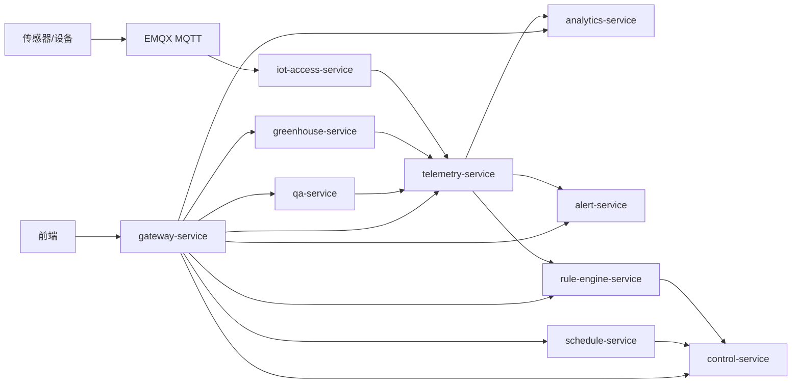
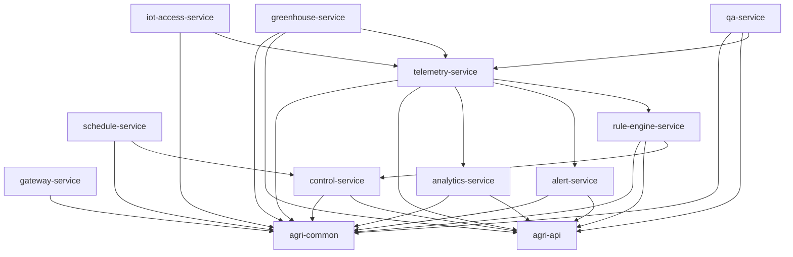

# 智慧农业项目实施与团队协作手册

## 1. 文档目的

本文档用于统一智慧农业项目的研发、协作、部署和交付标准，确保 4 名团队成员在 3 天冲刺周期内，围绕既定业务场景完成后端微服务项目的高质量交付。

本文档覆盖以下内容：

- 项目背景与目标
- 项目范围与边界
- 技术栈说明
- 环境配置要求
- 第三方依赖与版本建议
- 项目目录与依赖关系
- 团队成员分工与职责
- 任务分解结构（WBS）
- 时间节点与里程碑
- 沟通协作机制
- 开发规范与版本控制规范
- 测试要求与交付标准
- 部署流程与风险应对方案

## 2. 项目概述

### 2.1 项目名称

智慧农业微服务平台

### 2.2 项目目标

在 3 天内完成一个可运行、可联调、可演示、可交付的智慧农业后端微服务系统，支撑已有前端页面完成以下核心场景联调：

- 实时环境监测
- 历史趋势分析
- 阈值告警与审计
- 设备手动控制
- 补光灯定时控制
- 复合条件联动控制
- 多大棚统一监控
- 智能问答接口预留

### 2.3 本次冲刺交付定位

本次交付为“高质量阶段版本”，而非完整生产版，要求达到以下标准：

- 核心场景接口可调用
- 本地环境可一键启动或按文档快速启动
- 具备完整代码结构和技术架构
- 具备演示能力和基础测试能力
- 文档清晰，可支持后续继续开发

### 2.4 范围边界

本轮必须完成：

- 后端工程脚手架
- 基础环境配置
- 数据链路打通
- 核心场景接口实现
- 与现有前端联调
- 接口文档与部署文档
- 测试与交付说明

本轮允许降级实现：

- 智能问答可做占位接口或伪数据实现
- 联动规则可先支持简化条件表达式
- 多大棚可先实现基础汇总接口

本轮不作为硬性目标：

- 生产级 Kubernetes 集群部署
- 完整 CI/CD 平台自动化落地
- 复杂权限中心
- 完整移动端支持
- 全量 AI RAG 系统

## 3. 业务场景范围

项目基于业务图拆分为以下 8 个业务场景：

1. 全指标实时环境监测
2. 温湿度阈值告警与审计
3. 设备远程手动控制
4. 补光灯定时控制
5. 复合条件联动控制
6. 历史数据趋势分析
7. 多大棚统一监控与设备管理
8. 农事智能问答

## 4. 总体架构说明

### 4.1 架构目标

系统采用微服务架构，形成以下主链路：

`传感器/设备 -> MQTT Broker -> IoT 接入服务 -> 业务微服务 -> 数据库/缓存 -> 前端`

### 4.2 核心服务划分

- `gateway-service`：统一入口
- `iot-access-service`：设备协议接入与数据解析
- `telemetry-service`：监测数据入库与实时查询
- `analytics-service`：历史趋势分析
- `alert-service`：阈值告警与审计
- `control-service`：手动控制与回执处理
- `schedule-service`：定时控制
- `rule-engine-service`：联动规则处理
- `greenhouse-service`：多大棚监控与设备映射
- `qa-service`：智能问答预留

### 4.3 服务关系图



## 5. 技术栈说明

### 5.1 后端技术栈

| 类别 | 技术 | 版本建议 | 说明 |
|---|---|---:|---|
| JDK | OpenJDK | 21 | 主运行环境 |
| 框架 | Spring Boot | 3.3.x | 微服务基础框架 |
| 微服务治理 | Spring Cloud | 2023.0.x | 服务治理基础 |
| 注册配置中心 | Nacos | 2.3.x | 注册发现与配置管理 |
| API 网关 | Spring Cloud Gateway | 与 Spring Cloud 对齐 | 统一入口 |
| ORM | MyBatis-Plus | 3.5.x | 简化数据库访问 |
| 数据库 | PostgreSQL | 16 | 业务数据 |
| 时序扩展 | TimescaleDB | 基于 PG16 | 历史监测数据 |
| 缓存 | Redis | 7.2 | 最新值缓存、热点缓存 |
| 消息总线 | Kafka | 3.7.x | 异步事件流 |
| IoT 协议 | MQTT/EMQX | EMQX 5.x | 设备接入 |
| API 文档 | springdoc-openapi | 2.6.x | 接口文档 |
| 数据迁移 | Flyway | 10.x | 数据库脚本管理 |
| 监控 | Prometheus + Grafana | 最新稳定版 | 指标与看板 |
| 日志 | Loki 或 ELK | 可选 | 日志聚合 |
| 链路追踪 | OpenTelemetry | 最新稳定版 | 链路分析 |

### 5.2 第三方库依赖建议

| 依赖 | 用途 |
|---|---|
| `spring-boot-starter-web` | REST API |
| `spring-boot-starter-validation` | 参数校验 |
| `spring-cloud-starter-gateway` | 网关 |
| `spring-cloud-starter-alibaba-nacos-discovery` | 服务注册发现 |
| `spring-cloud-starter-alibaba-nacos-config` | 配置中心 |
| `mybatis-plus-spring-boot3-starter` | ORM |
| `postgresql` | PostgreSQL 驱动 |
| `flyway-core` | 数据库迁移 |
| `spring-boot-starter-data-redis` | Redis 访问 |
| `spring-kafka` | Kafka 集成 |
| `spring-integration-mqtt` 或 EMQX HTTP/MQTT SDK | 设备消息接入 |
| `springdoc-openapi-starter-webmvc-ui` | OpenAPI 文档 |
| `lombok` | 降低样板代码 |
| `mapstruct` | DTO 转换 |
| `testcontainers` | 集成测试 |
| `junit-jupiter` | 单元测试 |
| `mockito` | Mock 测试 |

## 6. 项目依赖关系说明

### 6.1 模块依赖原则

- 公共模块只能被业务模块依赖
- 业务服务之间尽量通过接口或事件交互
- 避免形成循环依赖
- 所有服务通过统一网关暴露给前端

### 6.2 服务依赖关系图



## 7. 项目目录建议

```text
smart-agri/
├─ backend/
│  ├─ pom.xml
│  ├─ agri-dependencies/
│  ├─ agri-common/
│  ├─ agri-api/
│  └─ agri-services/
├─ deploy/
│  ├─ compose/
│  ├─ helm/
│  └─ k8s/
├─ docs/
│  ├─ architecture/
│  ├─ api/
│  ├─ deployment/
│  └─ testing/
├─ scripts/
│  ├─ dev/
│  ├─ db/
│  └─ ci/
└─ sql/
```

## 8. 团队分工与职责说明

由于前端已完成，本项目按“业务场景闭环”进行分工。

### 8.1 成员分工总览

| 成员 | 负责场景 | 负责服务 | 核心职责 | 主要交付物 |
|---|---|---|---|---|
| 成员1 | 实时环境监测 + 历史趋势分析 | `iot-access-service` `telemetry-service` `analytics-service` | 数据接入、实时入库、趋势分析 | 实时监测接口、历史趋势接口、数据模拟脚本 |
| 成员2 | 阈值告警 + 告警审计导出 | `alert-service` | 阈值规则、告警记录、审计导出 | 告警接口、阈值配置接口、导出接口 |
| 成员3 | 手动控制 + 定时控制 | `control-service` `schedule-service` | 指令下发、状态回执、定时调度 | 控制接口、定时任务接口、执行日志 |
| 成员4 | 联动规则 + 多大棚管理 + 智能问答预留 + 公共集成 | `rule-engine-service` `greenhouse-service` `qa-service` `gateway-service` | 联动规则、多大棚汇总、统一配置与联调 | 联动接口、多大棚接口、占位 AI 接口、公共配置文档 |

### 8.2 各成员职责详细说明

#### 成员1：实时监测与趋势负责人

负责内容：

- 设备上报消息解析
- 监测数据标准化
- 最新值缓存
- 历史数据写入
- 时间区间趋势聚合
- 前端实时监测与趋势查询联调

交付要求：

- 实时查询接口可用
- 支持最近数据展示
- 支持按时间范围查询历史趋势
- 提供测试数据脚本

#### 成员2：告警负责人

负责内容：

- 阈值规则表设计
- 告警判定逻辑
- 告警记录入库
- 告警查询与状态管理
- 告警导出

交付要求：

- 支持温度、湿度阈值配置
- 支持超阈值自动告警
- 支持告警列表查询
- 支持导出告警记录

#### 成员3：控制负责人

负责内容：

- 手动控制接口
- 控制命令封装
- 设备回执处理
- 定时任务配置与触发
- 执行记录查询

交付要求：

- 前端操作后能触发控制链路
- 设备状态可更新
- 定时任务可配置和执行
- 有任务执行结果记录

#### 成员4：联动与集成负责人

负责内容：

- 复合规则联动接口
- 多大棚概况查询
- 智能问答占位接口
- 网关、统一配置、环境整合
- 全项目联调推进

交付要求：

- 联动规则可配置
- 命中规则可触发联动操作
- 多大棚总览可查询
- 对外接口统一接入网关

## 9. 任务分解结构（WBS）

### 9.1 一级任务

1. 项目初始化
2. 基础环境搭建
3. 场景 A 开发
4. 场景 B 开发
5. 场景 C 开发
6. 场景 D 开发
7. 联调测试
8. 部署与交付

### 9.2 二级任务明细

| WBS 编号 | 任务 | 负责人 | 输出物 |
|---|---|---|---|
| WBS-1 | 创建仓库结构、Maven 父子工程 | 成员4 | 初始工程 |
| WBS-2 | 搭建 Nacos、PostgreSQL、Redis、Kafka、EMQX | 成员4 | `docker-compose.yml` |
| WBS-3 | 设计核心数据库表 | 成员1/2/3/4 | SQL 脚本 |
| WBS-4 | 实现实时监测链路 | 成员1 | 实时监测接口 |
| WBS-5 | 实现历史趋势接口 | 成员1 | 趋势分析接口 |
| WBS-6 | 实现阈值告警逻辑 | 成员2 | 告警生成接口 |
| WBS-7 | 实现告警查询与导出 | 成员2 | 查询与导出接口 |
| WBS-8 | 实现手动控制 | 成员3 | 控制接口 |
| WBS-9 | 实现定时控制 | 成员3 | 定时任务接口 |
| WBS-10 | 实现联动规则 | 成员4 | 联动规则接口 |
| WBS-11 | 实现多大棚汇总 | 成员4 | 总览接口 |
| WBS-12 | 实现智能问答预留 | 成员4 | 占位接口 |
| WBS-13 | 联调与缺陷修复 | 全员 | 缺陷关闭记录 |
| WBS-14 | 文档整理与交付 | 全员，成员4 汇总 | 交付包 |

## 10. 3 天时间计划

### 10.1 总体节奏

- Day 1：环境与骨架完成，核心接口打底
- Day 2：业务闭环完成，前后端联调完成
- Day 3：测试修复、文档整理、部署验证、交付封版

### 10.2 每日计划明细

#### Day 1

目标：

- 完成基础工程和公共环境
- 完成所有服务骨架
- 完成接口文档第一版
- 打通监测、告警、控制三条主链路

安排：

- 成员1：MQTT 数据解析、实时数据入库、监测查询接口
- 成员2：告警规则表、告警判定逻辑、告警记录表
- 成员3：控制接口骨架、控制命令模型、回执模型
- 成员4：公共配置、网关、环境脚本、联动/多大棚表结构

检查点：

- 12:00：环境是否全部启动
- 18:00：第一版接口文档是否冻结
- 22:00：核心链路是否打通

#### Day 2

目标：

- 完成主要业务接口
- 与前端完成联调
- 场景 A/B/C 完整闭环

安排：

- 成员1：历史趋势接口、聚合与降采样
- 成员2：告警查询、导出、状态管理
- 成员3：定时任务执行与控制回执落库
- 成员4：联动规则接口、多大棚汇总接口、全局联调推进

检查点：

- 14:00：前端是否能调用主接口
- 18:00：A/B/C 场景是否闭环
- 22:00：D 场景是否具备演示能力

#### Day 3

目标：

- 回归测试
- 文档收口
- 部署验证
- 最终交付

安排：

- 成员1：修复监测与趋势问题
- 成员2：修复告警与导出问题
- 成员3：修复控制与调度问题
- 成员4：修复联动与总览问题，组织回归和打包交付

检查点：

- 12:00：高优先级缺陷清零
- 18:00：部署文档验证完成
- 22:00：完成封版

## 11. 依赖关系与并行策略

### 11.1 关键依赖

- `iot-access-service` 依赖 MQTT 与设备模拟数据
- `telemetry-service` 依赖 PostgreSQL/TimescaleDB 与 Redis
- `alert-service` 依赖监测数据流
- `control-service` 依赖设备映射和控制协议
- `schedule-service` 依赖控制服务
- `rule-engine-service` 依赖监测服务和控制服务
- `greenhouse-service` 依赖设备与监测聚合数据

### 11.2 并行开发策略

- Day 1 先统一表结构和接口字段
- 公共模块和环境优先完成
- 各业务场景在各自接口冻结后并行推进
- 任何公共配置变更需通知全员同步

## 12. 环境配置要求

### 12.1 本地开发环境

| 软件 | 版本要求 |
|---|---:|
| JDK | 21 |
| Maven | 3.9+ |
| Docker Desktop | 最新稳定版 |
| Node.js | 可选，前端已完成时非必需 |
| PostgreSQL Client | 可选 |
| Git | 2.40+ |
| IntelliJ IDEA | 推荐最新版 |

### 12.2 基础服务端口建议

| 服务 | 端口 |
|---|---:|
| Nacos | 8848 |
| PostgreSQL | 5432 |
| Redis | 6379 |
| Kafka | 9092 |
| EMQX MQTT | 1883 |
| EMQX 控制台 | 18083 |
| Prometheus | 9090 |
| Grafana | 3000 |
| Gateway | 8080 |
| iot-access-service | 8081 |
| telemetry-service | 8082 |
| alert-service | 8083 |
| control-service | 8084 |
| schedule-service | 8085 |
| rule-engine-service | 8086 |
| greenhouse-service | 8087 |
| analytics-service | 8088 |
| qa-service | 8089 |

## 13. 环境变量设置

建议统一通过 `.env` 或 Nacos 配置中心维护。

### 13.1 推荐环境变量

```bash
SPRING_PROFILES_ACTIVE=dev
NACOS_SERVER_ADDR=127.0.0.1:8848
POSTGRES_HOST=127.0.0.1
POSTGRES_PORT=5432
POSTGRES_DB=smart_agri
POSTGRES_USER=agri
POSTGRES_PASSWORD=agri123
REDIS_HOST=127.0.0.1
REDIS_PORT=6379
KAFKA_BOOTSTRAP_SERVERS=127.0.0.1:9092
MQTT_BROKER=tcp://127.0.0.1:1883
MQTT_USERNAME=admin
MQTT_PASSWORD=public
LOG_LEVEL_ROOT=INFO
```

### 13.2 配置原则

- 本地开发环境使用默认开发配置
- 密码、密钥、访问令牌不写死到代码中
- 生产配置统一放在配置中心或机密配置中

## 14. 安装与配置步骤

### 14.1 克隆项目

```bash
git clone <repository-url>
cd smart-agri
```

### 14.2 启动基础服务

```bash
docker compose -f deploy/compose/docker-compose.yml up -d
```

### 14.3 初始化数据库

```bash
psql -h 127.0.0.1 -U agri -d smart_agri -f sql/init.sql
```

### 14.4 启动后端服务

```bash
cd backend
mvn clean install
```

按顺序启动：

1. `gateway-service`
2. `iot-access-service`
3. `telemetry-service`
4. `alert-service`
5. `control-service`
6. `schedule-service`
7. `rule-engine-service`
8. `greenhouse-service`
9. `analytics-service`
10. `qa-service`

### 14.5 校验服务状态

- 检查 Nacos 是否注册成功
- 检查数据库表是否存在
- 检查 API 文档是否可访问
- 检查 MQTT 是否能收到设备模拟数据

## 15. 版本控制规范

### 15.1 分支管理

推荐采用简化 Git Flow：

- `main`：稳定交付分支
- `develop`：日常集成分支
- `feature/*`：功能分支
- `hotfix/*`：紧急修复分支

### 15.2 提交规范

提交信息采用以下格式：

```text
feat: 新增实时监测接口
fix: 修复告警重复触发问题
docs: 补充部署说明
refactor: 重构控制服务状态机
test: 增加趋势查询单元测试
chore: 调整本地环境配置
```

### 15.3 合并规则

- 禁止直接在 `main` 上开发
- 合并前必须完成自测
- 合并前必须同步接口文档更新
- 公共模块变更必须在群内通知

## 16. 开发规范说明

### 16.1 通用规范

- 统一使用 UTF-8 编码
- 接口统一使用 REST 风格
- 路径统一为 `/api/v1/...`
- 返回结构统一
- 统一异常码与错误信息

### 16.2 命名规范

- 类名：大驼峰
- 方法名：小驼峰
- 常量：全大写下划线
- 数据表：小写下划线
- 接口路径：小写短横线或名词复数

### 16.3 日志规范

- 关键链路打印请求 ID
- 错误日志必须带异常堆栈
- 设备控制、告警触发、联动触发必须落审计日志

### 16.4 接口规范

统一响应示例：

```json
{
  "code": 0,
  "message": "success",
  "data": {}
}
```

错误响应示例：

```json
{
  "code": 40001,
  "message": "参数校验失败",
  "data": null
}
```

## 17. 测试要求

### 17.1 测试类型

- 单元测试
- 集成测试
- 接口测试
- 场景冒烟测试
- 回归测试

### 17.2 必测场景

- 设备上报后实时数据能展示
- 历史趋势查询正常返回
- 阈值超限后能生成告警
- 手动控制能正确下发并返回状态
- 定时任务到点可执行
- 联动规则命中后触发控制
- 多大棚总览接口可正常返回

### 17.3 测试责任分工

- 各成员对自己负责的场景先完成自测
- 成员4 负责组织全链路冒烟测试
- 所有高优先级问题必须在 Day 3 中午前关闭

## 18. 质量标准与交付标准

### 18.1 质量标准

- 功能正确
- 接口稳定
- 环境可启动
- 文档可执行
- 演示可闭环

### 18.2 最终交付物

- 源代码
- `docker-compose` 文件
- SQL 初始化脚本
- 配置模板
- API 文档
- 部署说明
- 测试报告
- 演示说明
- 已知问题清单

### 18.3 交付验收标准

- 新成员按照文档可启动项目
- 各场景接口可正常调用
- 演示流程可完整跑通
- 文档与代码版本一致

## 19. 部署流程

### 19.1 本地部署流程

1. 启动基础中间件
2. 初始化数据库
3. 启动网关和各微服务
4. 启动设备模拟脚本
5. 验证前端联调

### 19.2 标准部署顺序

1. Nacos
2. PostgreSQL / TimescaleDB
3. Redis
4. Kafka
5. EMQX
6. Gateway
7. IoT 接入与业务服务

### 19.3 发布前检查

- 配置是否正确
- 数据库脚本是否已执行
- 端口是否被占用
- 服务是否全部注册
- API 文档是否更新

## 20. 风险应对预案

| 风险 | 表现 | 预案 |
|---|---|---|
| 环境不稳定 | Docker 服务启动失败 | 提前准备最小环境方案 |
| 数据链路打不通 | MQTT 收不到数据 | 使用模拟脚本兜底 |
| 接口字段不一致 | 前后端联调失败 | Day 1 冻结接口文档 |
| 控制回执不稳定 | 前端状态无法更新 | 提供模拟回执接口 |
| 范围过大 | 3 天内无法收口 | 优先保障 A/B/C 核心场景 |
| 测试滞后 | 上线前缺陷集中爆发 | Day 2 即开始回归测试 |

## 21. 项目里程碑

| 里程碑 | 时间 | 标准 |
|---|---|---|
| M1：工程初始化完成 | Day 1 中午 | 环境启动、目录完成、服务骨架建立 |
| M2：核心接口冻结 | Day 1 晚上 | 接口第一版稳定 |
| M3：核心场景闭环 | Day 2 晚上 | A/B/C 场景可联调 |
| M4：全链路回归完成 | Day 3 下午 | 所有高优先级缺陷关闭 |
| M5：项目封版交付 | Day 3 晚上 | 文档、代码、脚本统一交付 |

## 22. 沟通协调机制

### 22.1 固定站会

- `09:00`：晨会，确认当日目标
- `14:00`：联调检查会
- `21:00`：当日收口会

### 22.2 问题升级机制

- 阻塞超过 20 分钟必须上报
- 公共模块变更必须同步全员
- 影响整体交付的问题由成员4统一协调

### 22.3 共享产物

- 一份任务看板
- 一份接口清单
- 一份缺陷清单
- 一份部署说明

## 23. 附录：建议数据库对象

建议优先建立以下表：

- `agri_device`
- `agri_device_bind_record`
- `agri_telemetry_current`
- `agri_telemetry_history`
- `agri_alert_rule`
- `agri_alert_record`
- `agri_control_command`
- `agri_schedule_job`
- `agri_rule_definition`
- `agri_greenhouse`

## 24. 附录：建议接口清单

### 场景 A

- `GET /api/v1/telemetry/latest`
- `GET /api/v1/telemetry/history`
- `GET /api/v1/analytics/trend`

### 场景 B

- `POST /api/v1/alert-rules`
- `GET /api/v1/alerts`
- `GET /api/v1/alerts/export`

### 场景 C

- `POST /api/v1/control/commands`
- `GET /api/v1/control/commands/{id}`
- `POST /api/v1/schedules`

### 场景 D

- `POST /api/v1/rules`
- `GET /api/v1/greenhouses/overview`
- `POST /api/v1/qa/ask`

## 25. 结语

本项目文档用于统一团队执行标准，所有成员必须严格按照本文档推进开发、联调、测试和交付。若项目范围、技术方案或人员安排发生变化，应第一时间同步更新本文档，确保文档始终与项目实际状态保持一致。
